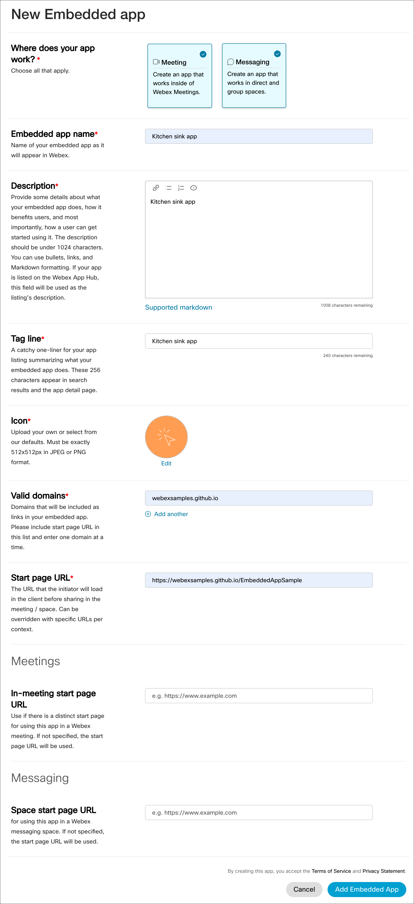
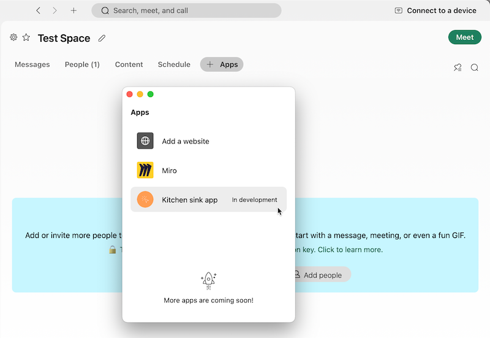
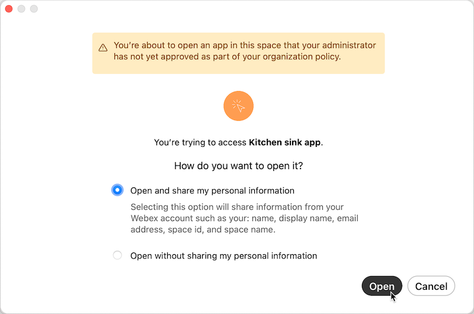
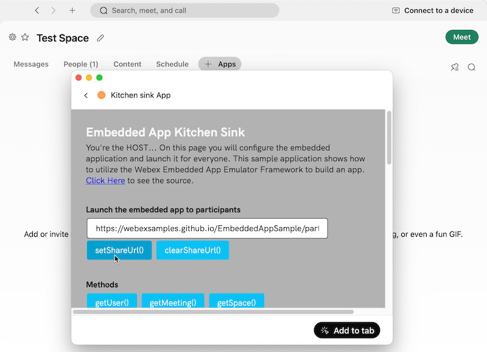
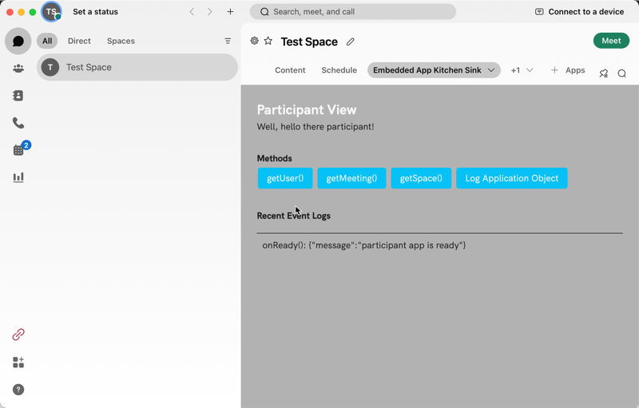
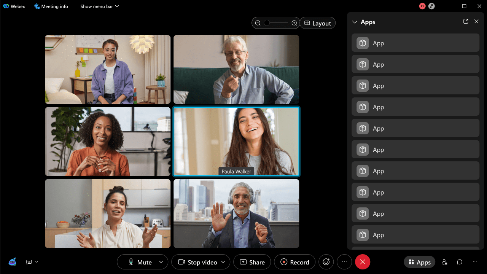
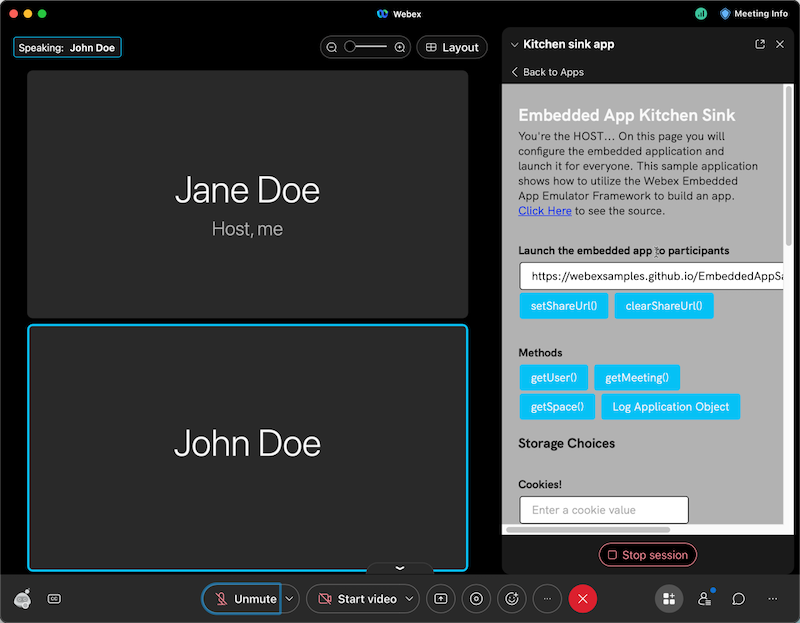

# Hello, developer!

This is a basic web application enabled with the [Webex Embedded Apps Framework](https://developer.webex.com/docs/embedded-apps).  As most "kitchen sink" applications do, it exercises all the events and methods that the framework offers. Be creative! the real magic happens in your own imagination. 🦄

## What's in this project?

- `README.md`: That's this file, an intro to what each file is and the details about the project.
- `style.css`: CSS files add styling rules to your content. We intentionally left things a bit sparse; feel free to expand on the look and feel as you see fit.
- `index.html`: This is the root page of the site; it also happens to be the "host" configuration page where an app is set up and prepared to be "pushed" (deployed) to the participants!
- `index.js`: This page contains the JavaScript which makes the index page do its magic. Feel free to poke around and see how simple it is to call methods and receive events!
- `participant.html`: This is the page that is pushed out to a participant; it has similar methods and events as the main page!
- `participant.js`: This page contains the JavaScript which feeds the participant experience. Feel free to poke around and see how simple it is to call methods and receive events!
- `utils.js`: This page contains the JavaScript with common utilities and functions across the applications.
- `loginWithWebex.js`: This page contains the JavaScript which handles the [Login with Webex](https://developer.webex.com/docs/login-with-webex) functionality.

## Next steps 🚀

Build an app! You can fork this project or start from scratch. Simply replace the default app URL in the Webex app with your own app URL... super easy!

- Need more help? [Check out our Help Center](https://support.webex.com/) for answers to any common questions.
- Ready to launch? [Deploy your app today](https://apphub.webex.com) to reach webex users in unique and clever ways, be the hero you always wanted to be.

## Onboarding and testing the KitchenSink app

You can use the deployed instance of the kitchen sink app ([https://webexsamples.github.io/EmbeddedAppSample](https://webexsamples.github.io/EmbeddedAppSample)) for testing in your own Webex meeting or messaging space.

* [Onboarding the app](#onboarding-the-app)
* [Test app in-space](#test-app-in-space)
* [Test app in-meeting](#test-app-in-meeting)

### Onboarding the app

**To on-board the kitchen sink app**:

1. Open the [New Embedded App](https://developer.webex.com/my-apps/new/embedded-app) page on the [Developer Portal](https://developer.webex.com/).
2. Enter or select the following app configuration options:

    * **Where does your app work?** &mdash; Select both **Meeting** and **Messaging** options
    * **Embedded app name** &mdash; Enter `Kitchen sink app`
    * **Description** &mdash; Enter `Kitchen sink app description`
    * **Tag line** &mdash; Enter `Kitchen sink app tag line`
    * **Icon** &mdash; Select one of the default icons (or upload your own).
    * **Valid domains** &mdash; Enter `webexsamples.github.io`
    * **Start page URL** &mdash; Enter `https://webexsamples.github.io/EmbeddedAppSample`

    Leave **In-Meeting start page URL** and **Space start page URL** at their default (empty) values.

    

3. Click **Add Embedded App**.

Next, test the app in a Webex messaging space or meeting. To fully test the experience in a meeting you will need to invite another participant to your meeting.

### Test app in-space

**To test the app in a Messaging space**:

1. In the Webex App, open an existing messaging space or create a new one for testing purposes. (Note: All users in the space will be able to see and open the app).

2. Click **+ Apps** space tab to open the **Apps** tray.

    

3. Click the Kitchen sink app to open its specified start page URL.

    Because your app hasn't been approved for use by your Webex site administrator a dialog appears asking if you'd like to share your personal information with the app or not. See [Personally Identifiable Information (PII) and Embedded Apps](https://developer.webex.com/docs/api/guides/embedded-apps-guide#personally-identifiable-information-pii-and-embedded-apps) for more information.

4. Select **Open and share my personal information** then click **Open**.

    

5. Click the **setShareURL** button, which makes the **Add to tab** button appear.

    

6. Click **Add to tab**. The app at the shared URL opens as a new tab.

    

### Test app in-meeting

**To test the app in a meeting:**

1. Start a meeting and invite a participant to join.
2. Click the **Apps** button to open the **Apps** tray.

    

3. Click **Kitchen sink app** and in the confirmation dialog select **Open and share my personal information** then click **Open**, as in the messaging space.

    The start page URL opens in a sidebar window.

4. Click **setShareUrl**. The **Open together** button appears.

5. Click **Open together** to open the shared URL for the meeting participant in a window.

6. To stop the session for the participant, click **Stop session**.

    

## Local Development

To start development locally with this sample application, clone the repo and install dependencies: 

- `git clone https://github.com/WebexSamples/EmbeddedAppSample.git`
- `npm install`

### Starting the Application

The application has a web server ready to use, run `npm start` to host on https://localhost:3000

### Login With Webex

In order to utilize the Login with Webex functionality locally, follow the steps on the [Login with Webex](https://developer.webex.com/docs/login-with-webex) documentation page to create a new integration.

Add the following URIs to the Redirect URI section:
- https://localhost:3000
- https://localhost:3000/participant.html
